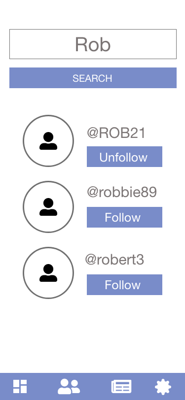

<h1 align="center">
Milestone Project 3 - SocialEyes - David O Neill
</h1>

<h1 align="center"> 

</h1>

<h2 align="center"><a href="http://socialeyes-ie.herokuapp.com/">Visit SocialEyes</a></h2>

<h4 align="center"> About SocialEyes </h4>
SocialEyes is a social media platform designed to encourage people to think about and discuss information they read. Whether it's a video, a news article, an instagram post, a research paper, or a podcast, SocialEyes gives people a platform to share their thoughts about the topic of their choice.    
             
<h4 align="center"> What makes SocialEyes different?</h4>
SocialEyes is designed differently than most social media media. While most, such as Facebook or Twitter, encourage 
quantity, we enourage quality. We hope to achieve this with a number of features:

 - No comments! Unlike other social media sites, we want the discussions to happen offline. See an article and opinion you
 find interesting? Show it to your partner and chat about it! We hope this feature will encourage more conversation and reduce 'trolling' and 'keyboard warrior' type behaviour.
            
- Only your latest post will show on your followers feed. Make each post count!
        
- You must provide a link to the content you are discussing. Our aim is to add credibility to posts and allows other users to form opinions alongside yours!

## Contents

1. [**UX**](#ux)
   - [**Strategy**](#strategy)
   - [**Scope**](#scope)
   - [**Structure**](#structure)
   - [**Design**](#design)
   - [**Surface**](#surface)

2. [**Features**](#features)
    - [**Features Implemented**](#Features-Implemented)
    - [**Possible Future Features**](#Possible-Future-Features)

3. [**Technologies Used**](#technologies-used)
    - [**Languages Used**](#Languages-Used)
    - [**Libraries Used**](#Libraries-Used)

4. [**Testing**](#testing)

5. [**Deployment**](#deployment)

## UX

### [**Strategy**](#strategy)

In this section, we need to develop the business goals, target audiences, and most
importantly the value our website/app will add for the user.

#### Business Goals

In terms of business goals, our social media site in theory can be developed into a space where advertisers and brands can 
spread their message to a targeted audience. SocialEyes can build a large database of users seperated into communities based on interests.

#### User Goals

- Learn more about what's happening in the world 
- Share their opinion and learn other's opinions on topics 
- Discover new points of view 
- Stay informed 

#### Target Audience

We must conisder how our audience might incluence our design (both visually and technically)
Our taget audience for this app is very wide (Roughtly: 18-50). Therefore, we need to make sure our application is designed with
encorporate all users that may land on our website. To do this, we can make sure:

- Our visual design is young enough not to be boring but also easily understood by an older audience
- Our app must be simple to use for all audiences

### [**Scope**](#scope)

In this section, we will discuss how features will align with our strategy. We need to identify what needs to be done, what tradeoffs we might need to make, 
and ask ourselves more about the user and their journey using our app. We will discuss the needs of the user.

#### What is the user looking for? 
Our user is looking for somewhere they can share opinions about what is happening around them, learn new points of view, follow
the thoughts of people they know, and stay informed. 

 
#### What the user might not know they need? 
From time to time, users might feel some content should not be on the platform 
To address this, we will need to include a way for users to 'object' or 'report' posts for review. 

### [**Structure**](#structure)

This section is concerned with how the content of the website will be organised. It will place structure on the user 
journey and make structural decisions based on our Strategy and Scope.

### Navigation

In terms of navigation, we need to ensure that getting around the site is easy and intuitive. 

The site will be divided into four sections 
- Dashboard 
- Follow/Find People 
- News 
- Settings 

The main menu will be fixed to the bottom of the page allowing the user to easily navigate between sections. 

We will also include intuitive navigation into our site: 
- When a user clicks on an avatar, it will take them to that users profile. 
- When the user clicks on their own avatar in the profile section, it will allow them to edit it
- When the user clicks on the about me section, it will allow them to update it 

### Feedback & Safety 

The user needs to feel safe throughout the experience and receive feedback for their actions. 

To do this we can include:
- Buttons change colour when interacted with 
- If the user types in a non-existant sub-directory, they will be given feedback and a link back to safety.
- Form validation will be clear and provide the necessary feedback to the user

### [**Design**](#design)

This section is concerned with how things might look and most importantly how we can give form (visual design) to function. 
We must remember that function and value is what is important and it should influence every design decision that is made.
 
Our goal with design is two fold
 - Rapidly establish value for the user
 - Lead and encourage the user to continue their experience

Our design must
 - Be audience appropriate
 - Meet the needs of the intended audience

Things to remember
 - Too many choices leads to confusion (too few leads to lack of customisation)
 - Minimum but effective design is key
 - Use conventions that people are used to (don’t change it unless it really adds more value)

 #### Register / Login (Landing Page)

Wireframes (Design ideas)
 

1.
- Function: It should be immediately obvious to the user what steps they can take in order to contintue their experience.
- Form: The user will be immediately met with a register option. If they are familiar with the site and have an account, they can login. 

2.
 - Function - The purpose of the site/app should be immediately obvious 
 - Form - We can include a logo and a subtitle that describes the purpose of the site. We can also include a 'learn more' button that 
    will give the user the option to learn about the site before registering. (However, ideally we want people to learn by using the site.
    The main purpose of the landing page is to encourage registration and provide a sense of intrigue. )

3.

- Function: The user should be able to register/login with a valid username, password, and email address 
- Form: We will include a registration form that provides real-time validation on user input 

- The username must be more than 3 characters in length and can only contain letters and numbers (no special characters)
- The password must be more than 5 characters and must contain at least one number 

- If the username or email has already been registered, the user must get clear feedback
- We will include a message in red text to provide the user with this feedback 

 #### Dashboard

1. 
- Function: The user should be able to view the latest posts from the users that they follow. 
- Form: We will display the latest post from each user they are following on the dashboard. 

2. 
- Function: The user should be able to select an avatar to use and edit an about me section to display at the top of their profile  
- Form: We will include an 'About me' section at the top of the dashboard. When the user clicks on the avatar, they will be able to change their avatar from a preset list

3. 
- Function: The user should be able to like posts that interest them 
- Form: We will include a heart icon that the user can press to like a post 

4. 
- Function: The user should be able to report a post if they think it isn't suitable to be on the site 
- Form: We will include a dropdown menu on each post that will allow the user to report a post 

5. 
- Function: The user should be able to delete a post if it is their own
- Form: Inside the dropdown menu, we will include an option to delete the post of it belongs to the logged in user 

6. 
- Function: The user should be able to easily write a post 
- Form: At the top of the posts section, we will include a post button that will display a modal with a form to post something. 

#### Find Users/Follow Users 

1. 
- Function: The user should be able to search for users to follow and follow them 
- Form:  We will include a search form where users can enter usernames and search for them - they can then view user profiles and follow users based on search results

2. 
- Function: The user should be able to view a list of users they are currently following and unfollow them if they wish
- Form: We will include a 'following tab' where users will see a list of users they currently follow

#### News 

1. 
- Function: The user should be able to view the latest news in their country of choice 
- Form: We will display a list of top news retrived from NewsApi and give the user a menu to choose a country

2. 
- Function: The user should be interact with the news article 
- Form: We will two buttons: one to allow the user to view the article and one to allow the user to make a post about that article  
 

#### Settings 

- Function: The user must be able to logout or delete their account if they wish to do so 
- Form: We will include an easily accessible menu that allows the user to take action on their account

### [**Surface**](#surface)

This section is concerned with Typography, Color schemes, imagery, and brand identity 

#### Typography 
/*------ */

#### Colour Scheme
Our colour scheme needs to be fun, invitive, and fresh. It needs to somewhat minic a game since the user will interact with the page alot.
For this reason  I have chosen a simlpe, bright colour scheme. 

#### Copy 
The copy for the website should be short and to the point. It should be easy to read against colours.

Any important user feedback should be presented in a distinct manner (form validation etc)

I have used these principles to guide the writing of copy for the website.

### Wireframes 

Wireframes are included in the UX above. They can also be accessed at "/wireframes"

Wireframes are mostly drawn in one resolution (mobile) because the site layout is essentially identical on all screen sizes.

## FEATURES

## Database Design 

This site links with a MongoDB database. There is one database divided into two collections - Users and Posts. 

Users stores details of each user. Posts stores details of each post. They are broken down as follows:

### Users
- _id [ObjectId] - Unique identifier generated by MongoDB
- Username [String] (provided at registration)
- Password [Hashed and Salted String] (provided at registration)
- Email Address [String] (provided at registration)
- Date Registered [Date]
- Description [String] - Holds the 'about me' text for the user - Default value of 'Tell us about yourself'
- Following [Array] - An array of strings containing the usernames that the user follows
- Discover[Boolean] - Stores a boolean value that let's users choose whether to appear in searches - Default is True
- Avatar [String] - Stores a URL to the users choosen avatar - Defaults to "Choose an Avatar" image

### Posts 
- _id [ObjectId] - Unique identifier generated by MongoDB
- Main_content [String] - Stores the main content of the users post
- Posted_by [String] - Stores the username associated with the post 
- Date_posted [Stirng] - Stores YY-MM-DD formatted date of posting
- Reported_by [Array] -  Array of strings storing usernames that have reported the tweet
- Content_link [String] - Stores the full url to the article 
- Short_url [String] - Stores a shortened version of the url for display purposes (May use in future versions)
- post_avatar [String] - Avatar associated with the user that created the post 

## Features-Implemented

#### Fixed Navbar 

The site contains a fixed navbar at the bottom of every page to allow the user to easily navigate between sections 

#### Registration/Login 

Users are able to create an account and login to that account using a choosen username and password. Passwords are encrypted using bcrypt
before being stored in the database. 

Registration details are validated in real-time using Javascript and JQuery. This provides the user with easy to understand
feedback to make the registration process as easy as possible. 

#### Dashboard 
The dashboard is divided into three sections - User Information, Write a post, and Latest Posts

- The user information section shows the users avatar and associated 'about me' text. Both items can be edited by clicking on them. The user can select from 6 avatar options and can write a short piece of text about themselves. This is then visible to anybody who views their profile.
- The write a post section allows the user to open a modal with a form to write a post. Posts must contain main content and also a link to the topic being discussed. A reminder of the post format is provided to the user above the form.
- The latest posts section shows the latest post from each user the person is following. It also shows the users own latest post. 
- There is a 'pull to refresh' option on posts that will allow users to refresh their dashboard posts being pulling down and releasing the section (as with twitter etc)

#### Post 
Each post has a number of interactive features 

- Like/Unlike a post - The user can like a post be clicking on the heart icon - The total number of likes each post has is displayed under the heart icon.
- Report/Unreport a post - If the user thinks the post of problematic for some reason, they can report a post (and remove that report). If a post receives two or more reports, a 'warning' ison will appear on the post. 
- Link to content - Each post contains a link icon that will bring the user to the original article/post/video etc being discussed 
- Delete a post - If the post was written by the logged in user then they will be given the option to delete the post 

#### Find Users / Follow Users / Unfollow Users 
This feature allows users to search for usernames and follow based on results. It also allows the user to look at a list of 
who they are following and unfollow anyone if they wish.

#### News
The news feature allows users to view the latest news based on country selected. Currenty, the user can select from Irish, Uk, or US news. 
Each news card contains a link to the original article and an option to post about that article. 

#### Settings 
The sections feature allows the user to logout of their account, delete their account (and associated posts) or read more about SocialEyes.

#### User Profile
A user profile can be viewed by navigating to /users/ExampleUsername

This allows users to view any users profile and all of their posts

#### 404 Page
If the user navigates to a page that doesn't exist (or inputs a username into the url bar that doesnt exist), they will be taken
to a custom 404 page that will provide them with a link back to their dashboard. 

## Possible Future Features
There is a large scope for future features. Some may include:
- More filter options for news (The API allows you to filter by news source, for examlpe)
- Custom Avatar building (option to upload their own)

## Technologies Used 

## Languages Used 

HTML5, CSS3, Javascript, Python  

### Libraries Used
* <a href="https://flask.palletsprojects.com/en/1.1.x/">Flask </a>
* <a href="https://getbootstrap.com/">Bootstrap 4 </a>
* <a href="https://jquery.com/">JQuery </a> - DOM manupulation
* <a href="https://www.mongodb.com/">MongoDB</a> - Database 
* <a href="https://www.npmjs.com/package/bcrypt">Bcrypt</a> - Used for password encryption 
* <a href="https://pymongo.readthedocs.io/en/stable/"> PyMongo</a> - Used to connect to MongoDB using python
* <a href="https://newsapi.org/">News API</a> - Used to grab latest news from different countries
* <a href="https://fontawesome.com/">Font Awesome </a> -Icons 
* <a href="https://fonts.google.com/">Google Fonts</a> - Typeography 
* <a href="https://github.com/">GitHub</a> - Used for version control and code hosting - Github pages used to host the final version of the game
* <a href="https://gitpod.io/">GitPod</a> - Used as an online IDE

## Testing 

Testing was carried out in a number of ways for this site. 

#### General Site Tests 
 - All interactive elements were checked first. On Desktop, any hover effects/color changes  
were checked (social media links). On mobile, the same effects were checked when links were clicked. 

 - Every link on the page was checked to ensure that it directed the user to the correct page. Every button was clicked and checked that 
it directed the user to the correct page.

 - Any links that activated popups were checked that they functioned correctly. All popups were checked to see if the 
'close' buttons function correctly. 

 - The site was then tested on multiple screen sizes and orientations (horizontal & vertical) using Chrome Developer Tools. 
All text was checked to make sure it was easily readible on any screen size. Item spacing was checked to make sure there was sufficient spacing between all elements on all screen sizes.

#### User Testing
- I tried to register a new account using a variety of credentials to test that the javascript validation was working 
- I tried to register a new account with an existing email to check that I got an error message 
- I registered with valid credentials to check that my account was created successfully 
- I then logged out and logged back in to the account to ensure logout and login functions were working correctly 
- I created a post and made sure that it appeared on my dashboard 
- I navigated to /users/myusername to ensure that my profile was displaying correctly 
- I created a few accounts and made posts on them 
- I then logged in to my own account, navigated to the search users section and checked that the other accounts appeared in the search
- I followed an account and checked that their latest post was displayed on my dashboard 
- I unfollowed the account and checked that the post was removed from my dashboard 
- I liked a post to check that the number of likes displayed updated correctly 
- I reported a post using 2 different accounts to check that the 'post reported' icon displayed on the post 
- I removed one report to check that the icon disappeared 
- I deleted a post and checked that it no longer appeared on my profile 
- I created a post from a news article to check that the correct article was linked in the post 
- I deleted my account and checked that i could no longer login and that my posts were deleted  

#### Code Validation 
- HTML code was ran though a HTML validator to ensure there were no errors (https://validator.w3.org/#validate_by_input)
- CSS code was ran though a CSS validator to ensure there were no errors (https://jigsaw.w3.org/css-validator/#validate_by_input)

#### Unit Testing

Tests can be found at /tests.py

Python unit tests were used to check the following:

- If the user tries to register with valid credentials, they are directed to their dashboard 
- If the user tries to register with invalid credentials, (email already exists) - they are presented with an error message 
- If the user tries to login with valid credentials, they are presented with their dashboard
- If the user tries to login with invaled credentials, they are presented with an error message 

#### Beta Testing 
A link to a beta version of the site was provided to a small group of people for testing. Any bugs found were then fixed. 

For examlpe, if they user had a username with special characters - this would interfere with finding the user  by using their profile link 

This was fixed by validating user input to only 

## Deployment 

* I used git init to initialise a local repository. 
* I used git add . - to add the base directory of project code into the local git repository 
* I used git commit -m ".." to commit to the local repository with a message containing information on the version 
* I used git push to push the local repository to the remote repositiry on GitHub

I took the following steps to deploy my project to Heroku. 

1. 
2. 
3. 
4. 
5. 

## Credits 
